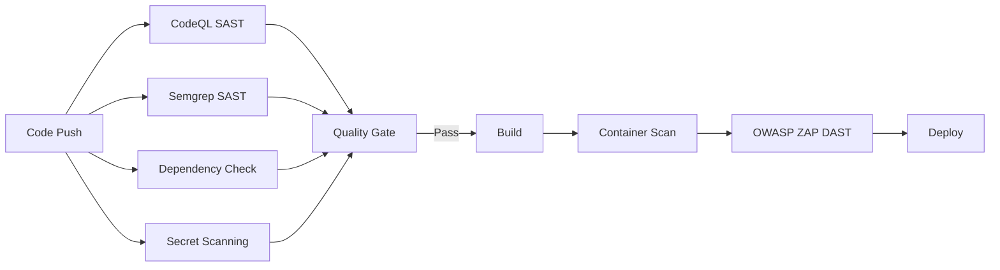

# BUTTERFLY Platform Security Overview

> **Version**: 3.0.0  
> **Last Updated**: December 2024  
> **Classification**: Internal - Security Sensitive

## Table of Contents

1. [Executive Summary](#executive-summary)
2. [Security Architecture](#security-architecture)
3. [Authentication & Authorization](#authentication--authorization)
4. [Multi-Tenancy & Isolation](#multi-tenancy--isolation)
5. [Transport Security (mTLS)](#transport-security-mtls)
6. [Data Security & Encryption](#data-security--encryption)
7. [Security Testing & Scanning](#security-testing--scanning)
8. [Compliance & Governance](#compliance--governance)
9. [Incident Response](#incident-response)
10. [Security Configurations](#security-configurations)

---

## Executive Summary

The BUTTERFLY platform implements a defense-in-depth security architecture designed to meet SOC2 Type II compliance requirements. This document provides a comprehensive overview of security controls across all services (PERCEPTION, CAPSULE, ODYSSEY, PLATO, NEXUS) and infrastructure components.

### Key Security Features

| Feature | Status | Implementation |
|---------|--------|----------------|
| JWT/OAuth2/OIDC Authentication | ✅ Implemented | `perception-api`, `perception-portal` |
| Role-Based Access Control (RBAC) | ✅ Implemented | All services |
| Multi-Tenant Isolation | ✅ Implemented | Database, API, Portal |
| mTLS Service Communication | ✅ Implemented | Kubernetes/Istio |
| Encryption at Rest | ✅ Implemented | PostgreSQL, Kafka, S3 |
| Encryption in Transit | ✅ Implemented | TLS 1.3 everywhere |
| SAST/DAST Security Scanning | ✅ Implemented | CI/CD pipeline |
| Security Regression Tests | ✅ Implemented | Backend & Portal |

### Zero Critical Vulnerabilities Commitment

All mainline branches maintain zero critical or high severity findings from:
- OWASP Dependency Check (failBuildOnCVSS=7)
- CodeQL SAST Analysis
- Semgrep Security Audit
- OWASP ZAP DAST Scanning
- Snyk Vulnerability Scanning

---

## Security Architecture

### Defense-in-Depth Model

```
┌─────────────────────────────────────────────────────────────────────────────┐
│                           EXTERNAL CLIENTS                                   │
└─────────────────────────────────────────────────────────────────────────────┘
                                    │
                                    │ HTTPS (TLS 1.3)
                                    ▼
┌─────────────────────────────────────────────────────────────────────────────┐
│ LAYER 1: NETWORK SECURITY                                                    │
│ • WAF (AWS WAF with OWASP rules)                                            │
│ • DDoS Protection (AWS Shield)                                              │
│ • Network Policies (Kubernetes)                                             │
│ • API Gateway Rate Limiting                                                 │
└─────────────────────────────────────────────────────────────────────────────┘
                                    │
                                    │ mTLS (Istio)
                                    ▼
┌─────────────────────────────────────────────────────────────────────────────┐
│ LAYER 2: AUTHENTICATION                                                      │
│ • JWT Token Validation                                                      │
│ • OAuth2/OIDC Resource Server                                               │
│ • API Key Authentication                                                     │
│ • Session Management (httpOnly cookies)                                     │
└─────────────────────────────────────────────────────────────────────────────┘
                                    │
                                    ▼
┌─────────────────────────────────────────────────────────────────────────────┐
│ LAYER 3: AUTHORIZATION                                                       │
│ • Role-Based Access Control (RBAC)                                          │
│ • Scope-Based Permissions                                                    │
│ • Tenant Isolation                                                          │
│ • @PreAuthorize Annotations                                                 │
└─────────────────────────────────────────────────────────────────────────────┘
                                    │
                                    ▼
┌─────────────────────────────────────────────────────────────────────────────┐
│ LAYER 4: APPLICATION SECURITY                                                │
│ • Input Validation (Bean Validation)                                        │
│ • Output Encoding                                                           │
│ • CSRF Protection                                                           │
│ • Security Headers                                                          │
└─────────────────────────────────────────────────────────────────────────────┘
                                    │
                                    ▼
┌─────────────────────────────────────────────────────────────────────────────┐
│ LAYER 5: DATA SECURITY                                                       │
│ • Encryption at Rest (KMS)                                                  │
│ • Field-Level Encryption (PII)                                              │
│ • Database Row-Level Security                                               │
│ • Audit Logging                                                             │
└─────────────────────────────────────────────────────────────────────────────┘
```

---

## Authentication & Authorization

### JWT/OAuth2/OIDC Configuration

The platform supports both internal JWT authentication and external OAuth2/OIDC providers.

#### Internal JWT (Default)

```yaml
# application.yml
perception:
  security:
    jwt:
      enabled: true
      access-token-expiration-ms: 3600000  # 1 hour
      refresh-token-expiration-ms: 86400000  # 24 hours
      include-tenant-claims: true
      enforce-revocation-checks: true
```

#### External OAuth2/OIDC

```yaml
perception:
  security:
    oauth2:
      enabled: true
      jwk-set-uri: ${OAUTH2_JWK_SET_URI}
      issuer-uri: ${OAUTH2_ISSUER_URI}
      audiences:
        - perception-api
      clock-skew-seconds: 60
      validate-issuer: true
      scope-claim-name: scope
      roles-claim-name: roles
      tenant-claim-name: tenant
```

### Role-Based Access Control (RBAC)

#### Predefined Roles

| Role | Permissions | Description |
|------|-------------|-------------|
| `ADMIN` | `read:*`, `write:*`, `admin:*`, `delete:*` | Full system access |
| `DEVELOPER` | `read:*`, `write:signals`, `write:scenarios`, `write:pipelines` | Development access |
| `ANALYST` | `read:signals`, `read:scenarios`, `read:events`, `write:feedback` | Analysis access |
| `OPERATOR` | `read:*`, `admin:monitoring`, `admin:health` | Operations access |
| `SERVICE` | `read:*`, `write:*` | Service account access |

#### Permission Enforcement

Permissions are enforced using Spring Security's `@PreAuthorize`:

```java
@PreAuthorize("@tenantAuth.hasPermission('write:signals')")
public ResponseEntity<...> createSignal(...) { }

@PreAuthorize("hasRole('ADMIN')")
public ResponseEntity<...> adminOperation(...) { }

@PreAuthorize("@tenantAuth.canAccess(#tenantId)")
public ResponseEntity<...> getTenantData(@PathVariable String tenantId) { }
```

---

## Multi-Tenancy & Isolation

### Tenant Context Flow

```
Request → TenantContextFilter → TenantContext.setCurrentTenant() → Service → Repository
                ↓                                                              ↓
          JWT Claims or                                              TenantAwareRepository
          X-Tenant-Id Header                                         (automatic filtering)
```

### Tenant Isolation Mechanisms

1. **API Layer**: `TenantContextFilter` validates tenant access
2. **Service Layer**: `@TenantScoped` aspect enforces tenant boundaries
3. **Repository Layer**: `TenantAwareRepository` filters queries by tenant
4. **Database Layer**: Row-level security policies (PostgreSQL)

### Configuration

```yaml
perception:
  multi-tenancy:
    enabled: true
    header: X-Tenant-Id
    default-tenant: global
    allowed-tenants:
      - global
      - tenant-alpha
      - tenant-beta
  security:
    rbac:
      enforce-tenant-isolation: true
      super-tenants:
        - global
```

---

## Transport Security (mTLS)

### Istio Service Mesh Configuration

All service-to-service communication is encrypted with mutual TLS via Istio.

```yaml
# mtls-policy.yaml
apiVersion: security.istio.io/v1beta1
kind: PeerAuthentication
metadata:
  name: perception-mtls-strict
  namespace: perception
spec:
  mtls:
    mode: STRICT
```

### Authorization Policies

```yaml
apiVersion: security.istio.io/v1beta1
kind: AuthorizationPolicy
metadata:
  name: perception-api-authz
spec:
  selector:
    matchLabels:
      app: perception-api
  action: ALLOW
  rules:
  - from:
    - source:
        principals: ["cluster.local/ns/perception/sa/perception-api-sa"]
```

---

## Data Security & Encryption

### Encryption at Rest

| Component | Encryption Method | Key Management |
|-----------|-------------------|----------------|
| PostgreSQL | AES-256 (RDS) | AWS KMS |
| Redis | AES-256 (ElastiCache) | AWS KMS |
| Kafka (MSK) | AES-256 | AWS KMS |
| S3/MinIO | SSE-KMS | AWS KMS |
| ClickHouse | AES-256 | Custom |

### Key Rotation

```hcl
# Terraform configuration
resource "aws_kms_key" "perception" {
  enable_key_rotation = true
  deletion_window_in_days = 30
}
```

### Secrets Management

Secrets are managed via:
1. **Development**: Environment variables / `.env` files (gitignored)
2. **CI/CD**: GitHub Actions Secrets
3. **Production**: AWS Secrets Manager / HashiCorp Vault

```yaml
# Kubernetes secret reference
env:
  - name: JWT_SECRET
    valueFrom:
      secretKeyRef:
        name: perception-secrets
        key: jwt-secret
```

---

## Security Testing & Scanning

### CI/CD Security Pipeline



### Tool Configuration

| Tool | Purpose | Failure Threshold |
|------|---------|-------------------|
| CodeQL | Static Analysis (Java) | Any finding |
| Semgrep | SAST + Secrets | ERROR severity |
| OWASP Dependency Check | CVE Scanning | CVSS ≥ 7.0 |
| TruffleHog | Secret Detection | Any verified secret |
| OWASP ZAP | Dynamic Testing | HIGH/CRITICAL |
| Snyk | Dependency Scanning | HIGH severity |
| Trivy | Container Scanning | HIGH/CRITICAL |

### Remediation SLAs

| Severity | Response Time | Resolution Time |
|----------|---------------|-----------------|
| Critical | 4 hours | 24 hours |
| High | 24 hours | 72 hours |
| Medium | 48 hours | 14 days |
| Low | 1 week | 30 days |

---

## Compliance & Governance

### SOC2 Control Mapping

| SOC2 Control | Implementation |
|--------------|----------------|
| CC6.1 Logical Access | JWT/OAuth2, RBAC |
| CC6.2 Prior Authorization | @PreAuthorize, Tenant Isolation |
| CC6.6 Encryption | TLS 1.3, KMS Encryption |
| CC6.7 Data Retention | Automated cleanup policies |
| CC7.1 Vulnerability Management | SAST/DAST scanning |
| CC7.2 Monitoring | CloudWatch, Prometheus |

### Security Headers

All API responses include:

```
Content-Security-Policy: default-src 'self'; script-src 'self'; ...
X-Content-Type-Options: nosniff
X-Frame-Options: DENY
X-XSS-Protection: 1; mode=block
Referrer-Policy: strict-origin-when-cross-origin
Permissions-Policy: geolocation=(), microphone=(), camera=()
Strict-Transport-Security: max-age=31536000; includeSubDomains; preload
```

---

## Incident Response

### Security Event Detection

1. **GuardDuty**: AWS threat detection
2. **Security Hub**: Centralized findings
3. **CloudWatch Alarms**: Anomaly detection
4. **Prometheus Alerts**: Application-level monitoring

### Incident Classification

| Level | Description | Example |
|-------|-------------|---------|
| P1 | Active exploitation | Data breach, ransomware |
| P2 | Critical vulnerability | CVE with exploit |
| P3 | High-risk issue | Authentication bypass |
| P4 | Medium-risk issue | XSS in admin panel |

### Response Procedures

1. **Detect**: Automated alerts trigger
2. **Contain**: Isolate affected systems
3. **Investigate**: Root cause analysis
4. **Remediate**: Fix and patch
5. **Review**: Post-incident review

---

## Security Configurations

### Environment Variables

```bash
# Authentication
JWT_SECRET=<base64-encoded-key-min-256-bits>
JWT_EXPIRATION=3600000
OAUTH2_ENABLED=false
OAUTH2_JWK_SET_URI=https://idp.example.com/.well-known/jwks.json
OAUTH2_ISSUER_URI=https://idp.example.com/

# Security Controls
RBAC_ENABLED=true
RBAC_TENANT_ISOLATION=true
HSTS_ENABLED=true
RATE_LIMIT_MAX_REQUESTS=180
RATE_LIMIT_WINDOW_SECONDS=60

# Encryption
KAFKA_SECURITY_PROTOCOL=SSL
DATABASE_SSL_MODE=verify-full
REDIS_SSL_ENABLED=true
```

### Production Checklist

- [ ] JWT secret rotated and stored in Secrets Manager
- [ ] OAuth2/OIDC provider configured (if using external IdP)
- [ ] mTLS enabled in Istio (STRICT mode)
- [ ] Database encryption enabled
- [ ] Kafka SSL/TLS enabled
- [ ] S3 bucket encryption enabled
- [ ] WAF rules enabled
- [ ] Security scanning in CI/CD
- [ ] HSTS enabled
- [ ] All secrets externalized
- [ ] Audit logging enabled
- [ ] Monitoring and alerting configured

---

## Related Documentation

- [Architecture Overview](architecture/ecosystem-overview.md)
- [Security Architecture](architecture/security-architecture.md)
- [Threat Model](THREAT_MODEL.md)
- [Secrets Management](SECRETS_MANAGEMENT.md)
- [Security Baseline](SECURITY_BASELINE.md)

---

## Version History

| Version | Date | Changes |
|---------|------|---------|
| 3.0.0 | Dec 2024 | Phase 3 security hardening complete |
| 2.0.0 | Nov 2024 | mTLS, RBAC, encryption at rest |
| 1.0.0 | Oct 2024 | Initial security baseline |

---

*This document is maintained by the BUTTERFLY Security Team. For security concerns, contact security@butterfly.internal*

